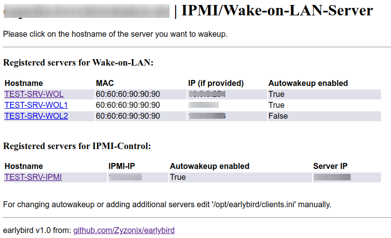

# earlybird - Wakeup servers automatically 

The main purpose of this programm is to wakeup servers after a powerloss.

## Quickjump

- [Command usage (CLI)](#usage)
- [Installation](#installation)
- [Configuration](#configuration)

## About

Therefore this programm contains two ways to wakeup servers automatically: either via WoL (Wake-on-LAN) or IPMI (Intelligent Platform Management Interface). 
In case a server was shut down, but no one wants to go to this server physically to power it on again, this programm provides also a simple webinterface that can wakeup hosts. (IP-Addresses and Hostnames are blurred)



This software is designed to be run on a Raspberry Pi. After a powerloss our UPS shut downs all our virtual hosts. Unfortunately it doesn't provide a feature to wake up devices when power is back. Our Raspberry Pi is not connected to the UPS so it shuts down on powerloss and reboots if power is back. When powered back on this programm then tries to wake up our virtual hosts via Wake-on-LAN or IPMI. After a predefined interval it sends also an email with wakeup-results to a configured mail address.


**Remind to configure WoL properly on all machines that should be waked up via Wake-on-LAN! (Wake-on-LAN: g)**
Those hosts must also be in the same network!
Additionally this scripts can only be executed on Linux and **systemd**-based distributions!
For clients being waked up via IPMI: the server hosting this software **must** have access to the IPMI interfaces of the servers!


## Usage
You can either wakeup registered servers via the webinterface or via CLI:
```
earlybird wakeup <servername>
```
To wakeup all enabled (autowakeup = ```True```) severs run:
```
earlybird wakeup all
```
List registered and properly configured servers with:
```
earlybird wakeup list
```

## Installation
The install directory is:
```
/opt/earlybird
```

To install ```earlybird``` use the following commands:
```
wget https://raw.githubusercontent.com/Zyzonix/earlybird/main/install.sh
```
And (as ```root```):
```
bash install.sh
```
The install script will to the rest!

## Configuration


**The log files can be found under ```/var/log/earlybird```**

Both scripts will try to resolve the local hostname to provide URLs (Web/Email), be sure that your ```/etc/hosts``` is correct!

### clients.ini
Define your hosts to wakeup within the file ```clients.ini``` along this scheme:
It is strongly recommended to define always all parameters, do not remove them, otherwise there might be a key-error!

**WoL-Server entries format:**
```
[HOSTNAME]
type = wol
description = PC-Description-here
mac = MACADDRESS 
autowakeup = True/False
client_ip = IPADDRESS
```
The parameters: ```type```, ```mac```, ```autowakeup``` and ```client_ip``` are required! 
```description``` can be left empty: ```description = ```
```HOSTNAME``` must be uppercase!

**IPMI-Server entries format:**
```
[HOSTNAME]
type = ipmi
autowakeup = True
ipmi_username = IPMIUSER
ipmi_password = IPMIPASSWD
ipmi_ip = IPADDRESS
cipher = 3
client_ip = IPADDRESS
```
The parameters: ```type```, ```autowakeup```, ```ipmi_username```, ```ipmi_password``` and ```ipmi_ip``` are required! ```client_ip``` is optional, **if no server IP should be provided, leave this key, but leave the value empty!** Errors might occur if ```client_ip``` is not present!
```HOSTNAME``` must be uppercase!
Leave ```cipher``` to the default value ```3```, only change this, if required!

### config.py

The following values are hardcoded at the beginning of the main configuration file:
**General configuration:**
Key | Setting
---|---
```SERVERIP``` | Define local IP on which the webserver should bind on
```WAKEUPINTERVAL``` | The interval between the program tries to wakeup configured servers
```RETRYCOUNT``` | Count of how often the program reruns


**Mail configuration:**
Key | Setting
---|---
```AUTH``` | (```True```/```False```) En- or disable authentication
```EMAILRECEIVER``` | If not empty: Email address where a confirmation mail will be send to
```EMAILSENDER``` | Address that should be displayed as sender, scheme can be ```Name <email@domain.com>```
```MAILSERVER``` | Hostname of your mail server
```MAILSERVERPORT``` | Port of your mail server (```25```/```465```/```587```)
```MAILUSER``` | Username for user that should send the email
```MAILPASSWORD``` | Password for the configured user

If you do not want to use authentication only ```MAILSERVER```, ```MAILSERVERPORT```, ```EMAILSENDER``` and ```EMAILRECEIVER``` are required. 
If you wish to disable mailing, just leave all values empty (replace with ```""```).

**A wrong/malformed config file can end up in errors!**


## To-Do
* Move all install instructions to an installation file
* Provide current power status on startpage (required JS)
* Add comment section to each entry in client.ini that is later presented on the webclient for an easier identifying
* Add option to set timestamp for autowakeup, should include also weekdays

----

This program is the successor of Zyzonix's ```attic/wolserver```


